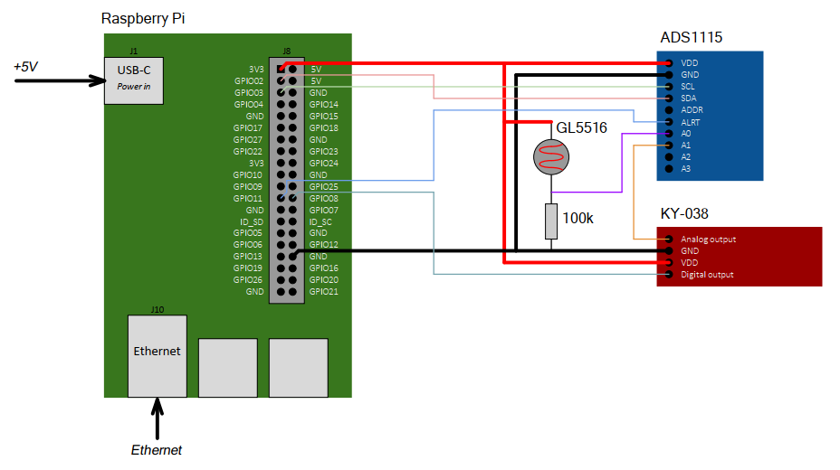

## Вариант 1 курсового проекта дисциплины "Операционные системы" - В01

__Описание задания:__  
Необходимо разработать прототип встраиваемой системы, как совокупность программного обеспечения и стенда на базе Raspberry Pi4, которая позволяла бы определять расстояние до грозы по принципу измерения транзитного времени – разница между вспышкой (имитируется фонарем) и звуковым сигналов (имитируется хлопком). Встраиваемая система должна обеспечивать измерение расстояний для серии из нескольких вспышек и последующих за ними звуковыми сигналами. Результат измерения расстояния (или серии измеренных расстояний) должны выводиться в терминале персонального компьютера, подключенного к встраиваемой системе через ssh-соединение.  

__Общая схема и принципы работы встраиваемой системы:__  
Схема соединений всего используемого оборудования представлена на рисунке ниже:  

__Перечень используемого оборудования:__
* микрокомпьютер Raspberry Pi 4;
* отладочная плата OS с подключенными: модуль АЦП ADS1115 16-Bit, датчик звука KY-038, фоторезистор GL5516;
* персональный компьютер c установленным ПО (Putty, WinSCP, Git).

__Требования к работе встраиваемой системы:__  
1. Встраиваемая система должна обеспечивать вычисление расстояния до грозы за счет выполнения трех основных программ: 1 – программа, принимающая сигналы с датчика звука, 2 – программа, принимающая сигналы с фоторезистора, 3 – программа, получающая данные от программ 1 и 2 по одному из способов межпроцессного взаимодействия (именованные и неименованные каналы).  
2. Программа-1 должна обеспечивать взаимодействие RPi с датчиком звука по GPIO и выполняет следующие функции:  
* чтение значений GPIO о срабатывании датчика звука;
* изменение скорости опроса датчика звука по аргументу при старте или через команду по именованным/не именованным каналам;
* отправка сигнала о хлопке с временной меткой системы по именованным/не именованным каналам;
* далее данная программа должна быть преобразована в драйвер символьного устройства GPIO и подключаться при старте операционной системы
3. Программа-2 должна обеспечивать взаимодействие RPi 4 с модулем АЦП ADS1115 по интерфейсу I2C и выполняет следующие функции:  
* настройка режима работы АЦП: тип подключения - несимметричный/дифференциальный, скорость обработки данных;
* запись и чтение значений регистров АЦП;
* изменение скорости опроса АЦП по аргументу при старте или через команду по именованным/не именованным каналам;
* преобразование данных АЦП в значение освещенности;
* установка уровня освещенности для распознавания вспышки по аргументу при старте или через команду по именованным/не именованным каналам;
* отправка сигнала о вспышке с временной меткой системы по именованным/не именованным каналам;
4. Программа- 3 должна обеспечивать взаимодействие с программами-1,-2 и стандартным вводом, работает в многопоточном режиме, а также выполняет следующие функции:  
* обмен сообщениям по именованным/не именованным каналам с приложениями-1,-2;
* обмен сообщениями со стандартным потоком ввода/вывода, в том числе прием команд от пользователя (stop, restart, last).  
5. Встраиваемая система должна обеспечивать выдачу результатов работы на консоль в следующем формате:  
* сообщение 1 типа: «время измерения вспышки № х: _____» (hh:mm:ss);
* сообщение 2 типа: «время измерения хлопка № х: _______» (hh:mm:ss);
* сообщение 3 типа: «расстояние до грозы № х: ______» в метрах.

__Порядок выполнения и сдачи [курсового проекта](var_01_task.md):__
1. [Этап проекта №1](var_01_stage_01.md)
2. [Этап проекта №2](var_01_stage_02.md)
3. [Этап проекта №3](var_01_stage_03.md)
4. [Этап проекта №4](var_01_stage_04.md)
5. [Этап проекта №5](var_01_stage_05.md)
6. [Этап проекта №6](var_01_stage_06.md)
7. [Этап проекта №7](var_01_stage_07.md)
8. [Этап проекта №8](var_01_stage_08.md)

