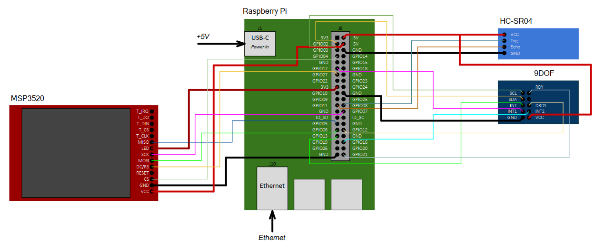

## Вариант 9 курсового проекта дисциплины "Операционные системы" - В09

__Описание задания:__  
Необходимо разработать прототип встраиваемой системы, как совокупность программного обеспечения и стенда на базе Raspberry Pi4, которая реализует функции полетного контролера. Данные об направлении движения, углов ориентации и высоты определяются с помощью навигационного модуля (9DOF) и дальномера (высота от поверхности), данные выводятся на LCD-дисплей. Все действия должны дублироваться в терминал персонального компьютера, подключенного к встраиваемой системе через ssh-соединение.   

__Общая схема и принципы работы встраиваемой системы:__  
Схема соединений всего используемого оборудования представлена на рисунке ниже:  

__Перечень используемого оборудования:__
* микрокомпьютер Raspberry Pi 4;
* отладочная плата OS с подключенными: дальномером GP2Y0A02YK0F (поключение через ADC1115), навигационным модулем 9DOF, а также LCD MSP3521;
* персональный компьютер c установленным ПО (Putty, WinSCP, Git).

__Требования к работе встраиваемой системы:__  
1. Встраиваемая система должна обеспечивать вывод навигационных параметров объекта за счет выполнения трех основных программ: 1 – программа, работающая с LCD-дисплеем и выводящая навигационные параметры, 2 – программа, принимающая сигналы с дальномера и определяющая высоту объекта и передающее ее в программу-1, 3 – программа, принимающая и обрабатывающая данные навигационного модуля и передающая результат обработки в программу-1 по одному из способов межпроцессного взаимодействия (именованные каналы).
2. Программа-1 должна обеспечивать взаимодействие RPi с модулем LCD-Display по интерфейсу SPI и выполняет следующие функции:
* настройка и инициализация LCD-дисплея;
* запись и чтение значений регистров LCD-дисплея;
* прием данных от навигационного модуля и дальномера по именованным каналам;
* построчный вывод параметров движения (углы ориентации, ускорения, дирекционный угол, высота) с частотой 10Гц; Опционально: отрисовка параметров движения объекта.
3. Программа-2 должна обеспечивать взаимодействие RPi с дальномером по I2C и выполняет следующие функции:
* запись и чтение значений в регистры АЦП по I2C и вычисление расстояния от поверхности;
* отправка значения расстояния с временной меткой системы по именованным каналам.
4. Программа-3 должна обеспечивать взаимодействие с навигационным модулем по I2C, а также выполняет следующие функции:
* настройка и инициализация навигационного модуля по I2C;
* чтение и запись данных с I2C для получения навигационных параметров: углы ориентации (тангаж, рыскание, крен), ускорения по осям xyz, показания магнетометра;
* передача навигационных параметров в программу -2 по именованному каналу.
* обмен сообщениями со стандартным потоком ввода/вывода, в том числе прием команд от пользователя (см. общие требования к работе ВС);
5. Встраиваемая система должна обеспечивать выдачу сообщений с навигационными параметрами встраиваемой системы в следующем формате: 
* «Время ______ («hh:mm:ss»)»;
* «Углы ориентации: _______(град/град/град)»;
* «Высота: ________ (м)»;
* «Направление движения: _______ (град)»;

__Порядок выполнения и сдачи [курсового проекта](var_09_task.md):__
1. [Этап проекта №1](var_09_stage_01.md)
2. [Этап проекта №2](var_09_stage_02.md)
3. [Этап проекта №3](var_09_stage_03.md)
4. [Этап проекта №4](var_09_stage_04.md)
5. [Этап проекта №5](var_09_stage_05.md)
6. [Этап проекта №6](var_09_stage_06.md)
7. [Этап проекта №7](var_09_stage_07.md)
8. [Этап проекта №8](var_09_stage_08.md)
